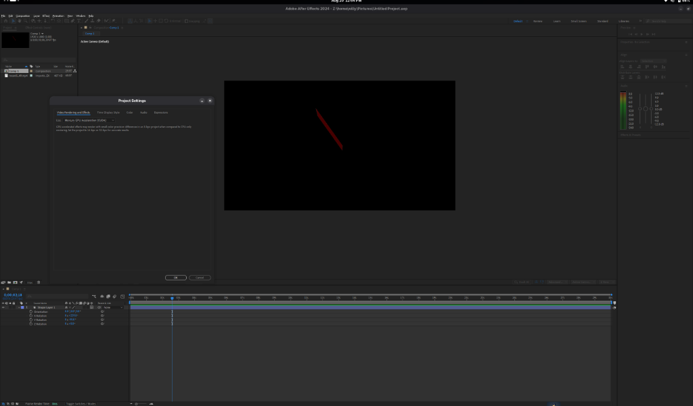
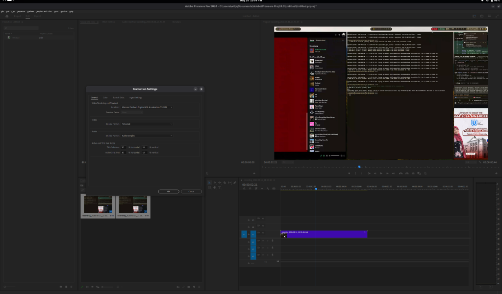
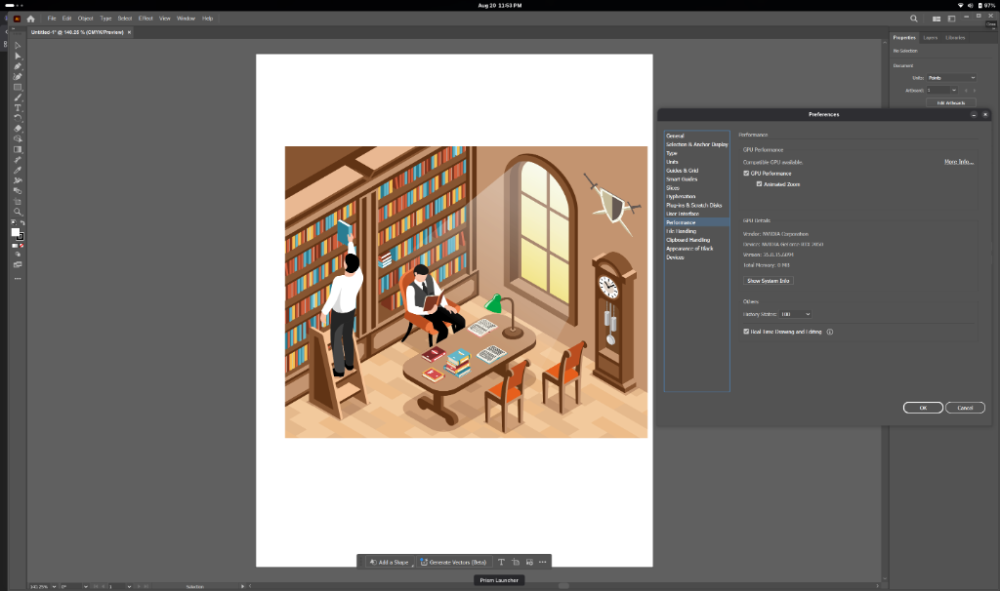

<div align="center">


# CCNux

**Next-Generation Native GTK4 Linux Manager for Adobe Creative Cloud 2024 Suite**

[](https://kernel.org)
[](https://gtk.org/)
[](https://www.winehq.org/)
[](https://github.com/doitsujin/dxvk)
[](https://www.gnu.org/licenses/gpl-3.0)

<br/>

> **CCNux** abstracts away the complexity of Wine prefixes, DXVK pipelines, OpenCL GPU drivers, and system font configurations—providing a seamless, native Linux experience for professional digital artists using the Adobe 2024 suite.

---

</div>

## Supported Applications (2024 Suite)

| Application | Version | Status | Technical Focus & Acceleration |
| :--- | :---: | :---: | :--- |
| **Adobe After Effects** | `2024` | Working | Advanced 3D Renderer (Xwayland), DXVK Vulkan, ScriptUI Panels & Plugin Routing |
| **Adobe Premiere Pro** | `2024` | Working | OpenCL `nvidia.icd` dGPU Isolation, Mercury Playback Engine CUDA & UXP Panels |
| **Adobe Illustrator** | `2024` | Working | NVIDIA GPU Acceleration, UXP Home Screen, Direct3D CSMT Level 3 & `AdobeCleanUX` Font Engine |
| **Adobe Photoshop** | `2024` | WIP | Direct3D 11 / DXVK acceleration & Native Font Smoothing |
| **Adobe Media Encoder** | `2024` | WIP | Background encoding and export queue support |

> **GPU Acceleration & UXP Canvas in Action**:
> 
> 
> 
> 
> 
> 
> *After Effects (top left), Premiere Pro (top right), and Adobe Illustrator 2024 (bottom) successfully leverage GPU Acceleration (NVIDIA CUDA / Direct3D), UXP Home Screen, and real-time vector canvas rendering through CCNux 2.0.*

---

## Key Features

- **Zero-Hardcoding Dynamic GPU Auto-Detection**: Dynamically queries sysfs PCI IDs (`/sys/class/drm/`) and `nvidia-smi` telemetry to configure Direct3D VRAM, CSMT multithreading, and DXVK profiles without manual user editing.
- **Modern UXP & Home Screen Engine**: Bundles the 10-font `AdobeCleanUX` suite, pre-patched UXP compatibility manifests, and Vulcan IPC broker DLLs for Illustrator, Premiere Pro, and After Effects.
- **Automated Core Asset Auto-Fetch**: Downloads and extracts `ccnux-core-assets-newest.zip` directly from GitHub Releases on first launch to keep the initial application binary size under 5MB.
- **Modular Plugin Routing Architecture**: Dedicated subsystem for installing, scanning, and managing third-party extensions (Mister Horse Animation Composer, FX Console, CEP, UXP, AEX binaries, and ScriptUI Panels).
- **Native Linux Desktop & MIME Associations**: Provides desktop shortcuts and file associations for `.ai`, `.eps`, `.svg`, `.pdf`, `.aep`, `.prproj`, and `.psd` with smart XDG application chooser support.
- **Fast Asynchronous Launcher**: Non-blocking `spawn_app` execution launches splash screens and product runtimes in under 2 seconds.

---

## How to Install & Use Adobe Apps

CCNux manages portable or pre-installed versions of Adobe 2024 applications. Follow these simple steps:

1. **Prepare a Portable Version**: Package a pre-installed version of your Adobe 2024 app (e.g. Illustrator, Premiere Pro, After Effects) into a `.zip` archive on Windows or Linux.
2. **Launch CCNux**: Open CCNux from your app launcher or terminal.
3. **Extract & Setup**: Click **Install / Add Product** in CCNux and select your archive or executable. 
   > *CCNux will automatically provision Wine prefixes, inject DXVK Vulkan profiles, copy `AdobeCleanUX` fonts, and register `.desktop` shortcuts.*

### Command-Line Usage

You can also launch products directly or open projects from your shell:

```bash
# Launch Adobe Illustrator 2024 with a vector file
ccnux --run illustrator-2024 ~/Documents/logo.eps

# Launch Adobe Premiere Pro 2024 with a video project
ccnux --run premiere-pro-2024 ~/Videos/project.prproj

# Launch Adobe After Effects 2024 with a motion graphics composition
ccnux --run after-effects-2024 ~/Projects/animation.aep
```

---

## Technical Deep-Dive

<details>
<summary><b>How Advanced 3D Engine in After Effects 2024 Was Achieved</b></summary>
<br>

1. **DXVK Graphics Pipeline Library (GPL) & Shader Caching**
   - Configured `dxvk.gplPipelineCache = True` and `dxvk.enableAsync = True` to compile Vulkan shader pipelines asynchronously.
   - Automatically scales compiler threads (`dxvk.numCompilerThreads = 0`) across all available CPU cores, eliminating viewport stutters when manipulating 3D scenes.
2. **Unthrottled Low-Latency Xwayland Presentation**
   - Applied `__GL_SYNC_TO_VBLANK = 0` and `vblank_mode = 0` when running under Xwayland.
   - Directs frame presentation synchronization to the Wayland compositor (Mutter, KWin, Hyprland), unlocking tearing-free 60+ FPS preview playback.
3. **Win32 Memory & Subsystem Optimizations**
   - Enabled `WINE_LARGE_ADDRESS_AWARE = 1`, `WINEESYNC = 1`, `WINEFSYNC = 1`, and `STAGING_WRITECOPY = 1` for high-throughput memory operations during 3D composition rendering.
   - Isolated native `dwrite.dll` text rendering (`dwrite=n,b`) to prevent font engine crashes in 3D text layers.
4. **CUDA Acceleration & UI Rendering Optimizations**
   - Injected `EnableCUDA=true` and `CUDA_VISIBLE_DEVICES=0` to force Mercury Playback Engine GPU acceleration natively on Linux NVIDIA drivers.
   - Disabled UI Hardware Acceleration (`Display.EnableUIHardwareAcceleration=false`) and forced native Windows GDI+ (`gdiplus=n,b`) to completely bypass `d2d1` OpenGL translation bottlenecks.
</details>

<details>
<summary><b>How Adobe Premiere Pro 2024 Launch & Stability Was Achieved</b></summary>
<br>

1. **OpenCL Driver Isolation (`nvidia.icd`)**
   - Configured `OCL_ICD_VENDORS = "nvidia.icd"` to prevent `intel-compute-runtime` from aborting inside Wine on hybrid Intel + NVIDIA laptops.
2. **AdobeIPCBroker Daemon Launch Parameter**
   - Launched `AdobeIPCBroker.exe` with `-relaunchedForIntegrityLevel`, ensuring Premiere Pro connects to its background IPC server without hanging on startup.
3. **CEPHtmlEngine ICU DLL Resolution**
   - Implemented `ensure_product_icu_aliases()` to automatically propagate all ICU DLLs (`icuin.dll`, `icuuc.dll`, etc.) directly into `CEPHtmlEngine/` subdirectories.
4. **Stability & Overlay Bypasses**
   - Automatically renames `RadialController.dll` to `RadialController.dll.disabled` to stop `win32u.dll` `EXCEPTION_ACCESS_VIOLATION` crashes.
   - Enables UXP start screen overlay with global `AdobeCleanUX` font synchronization.
</details>

<details>
<summary><b>How Adobe Illustrator 2024 GPU Acceleration & UXP Home Screen Was Achieved</b></summary>
<br>

1. **Direct2D Engine Coupling (`d2d1=b,n`) & GDI Panel Patch**
   - Resolved UI engine (`dvaui.dll` & `dynamic-torqnative.dll`) crash (`status c0000135`) by enforcing Direct2D native/builtin coupling (`d2d1=b,n`).
   - Eliminated top-right dockable panel clipping/diagonal line artifacts (Wine Bug 30615) through custom Wine runner patches.
2. **NVIDIA Zero-Hardcode Telemetry & CSMT Level 3 Execution**
   - Dynamically queries sysfs PCI Vendor ID & Device ID alongside `nvidia-smi` to inject exact GPU model telemetry into Direct3D registry (`csmt=3`, `StrictDrawOrdering=disabled`, `MaxFrameLatency=1`).
   - Unlocks full NVIDIA GPU Performance, Animated Zoom, and Real-Time Vector Drawing natively on Linux.
3. **`AdobeCleanUX` Font Extraction & UXP Home Screen Overlay**
   - Integrates the 10-font `AdobeCleanUX` suite directly into global `drive_c/windows/Fonts/` and UXP resource paths.
   - Auto-patches UXP manifest `minVersion` templates to render modern "New Document" dialogs and Home Screen workspace overlays flawlessly.
</details>

---

## Architecture Overview

CCNux uses a decoupled OOP architecture separating the GTK4 UI, generic installer services, specialized product installers, and modular execution managers. For full class hierarchy breakdown, Mermaid sequence diagrams, environment variable tables, and statistics, refer to [**TECHNICAL.md**](TECHNICAL.md).

---

## Building from Source

### Dependencies
- **Build Tools**: `meson`, `ninja`, `vala`, `pkg-config`, `gcc`
- **Libraries**: `gtk4`, `libadwaita-1`, `libsoup-3.0`, `glib-2.0`
- **Runtime**: `wine` (staging recommended), `vulkan-icd-loader`, `cabextract`

```bash
# Clone repository
git clone https://github.com/willyyypatootieee/CCNux.git
cd CCNux

# Setup build directory & compile
meson setup build
meson compile -C build

# Launch CCNux
./build/ccnux
```

---

## Development Roadmap

### Completed (v2.0 Core Milestones)

- [x] **Full Creative Cloud 2024 Suite Engine**: Initial release supporting After Effects, Premiere Pro, Illustrator, and Photoshop.
- [x] **Advanced 3D Renderer in After Effects**: Native Xwayland execution with GPL shader caching and 60+ FPS preview playback.
- [x] **GTK4 / Libadwaita Vala Interface**: Responsive, modern Linux desktop interface (`CCNux`).
- [x] **Fast Async Launcher (`spawn_app`)**: Non-blocking process execution displaying splash screens in under 2 seconds.
- [x] **OpenCL Driver Isolation (`nvidia.icd`)**: Prevents `intel-compute-runtime` crashes on hybrid Intel + NVIDIA laptops.
- [x] **DXVK GPL Pipeline Cache & Async Compilation**: Zero-stutter Vulkan shader compilation.
- [x] **CEPHtmlEngine ICU DLL Resolution**: Automatic propagation of `icuin.dll` and `icuuc.dll` for extension panels.
- [x] **Live Font Synchronization & Smoothing**: Auto-syncs Linux system fonts to Wine prefixes.
- [x] **Clean OOP Architecture Refactor**: Installer factory pattern with `ProductRuntimePolicy`.
- [x] **Desktop MIME Associations**: Integrated file handlers for `.ai`, `.eps`, `.svg`, `.pdf`, `.aep`, `.prproj`, and `.psd`.
- [x] **Dynamic Core Asset Auto-Fetch**: Automated GitHub Releases asset downloading (`ccnux-core-assets-newest.zip`).
- [x] **Adobe Illustrator 2024 GPU Acceleration**: Full NVIDIA Direct3D CSMT 3 telemetry, UXP Home Screen, and font integration.
- [x] **Modular Plugin Routing Subsystem**: Modular `PluginDetector`, `PluginScanner`, and `PluginRoutingService` implementation.

### Phase 2: Active Development & Enhancements

- [ ] 🚧 **Extended Adobe Version Matrix (2015 to Latest 2025+)**: Support for legacy Adobe releases (2015–2023) alongside version auto-detection for upcoming 2025+ releases.
- [ ] 🚧 **Adobe Photoshop 2024 Stability Profiling**: Complete D3D11 / DXVK acceleration tuning, canvas panning optimization, and isolated font rendering.
- [ ] 🚧 **One-Click Mister Horse & FX Console Installer**: Fully automated GUI installation flow for Mister Horse Animation Composer 3/4 and Video Copilot FX Console.
- [ ] **Custom Wine Runner Manager**: GUI panel to select and switch between custom patched Wine runners, Wine-Staging, or Valve Proton binaries.
- [ ] **High-DPI Display Auto-Scaling**: Dynamic Windows registry scaling (`LogPixels` / `AppliedDPI`) matching GTK display scale factors.
- [ ] **AMD RADV & Intel ANV Drivers Optimization**: Specific Mesa Vulkan driver profiles and fallback overrides for AMD Radeon and Intel Arc graphics.

### Phase 3: Packaging & Ecosystem Expansion

- [ ] **Self-Contained Flatpak & AppImage Packages**: Universal single-file Linux application bundles with pre-configured Wine runtimes.
- [ ] **Native Distribution Packages**: Build scripts and PKGBUILDs for Arch Linux (AUR), Debian/Ubuntu (`.deb`), and Fedora (`.rpm`).
- [ ] **Adobe Creative Cloud Desktop App Bridge**: Support for running official CC desktop services for login and cloud library sync.
- [ ] 🚧 **Media Encoder 2024 Integration**: Background queue rendering support across After Effects and Premiere Pro.
- [ ] **Automated Hardware & GPU Diagnostics**: Built-in diagnostic wizard analyzing `vulkaninfo`, `clinfo`, and driver capabilities before app launch.

---

## My Test Bed

For transparency and benchmarking, here is the hardware and software configuration used to develop and test CCNux daily:

- **OS**: CachyOS x86_64
- **Kernel**: Linux 7.1.8-1-cachyos
- **Environment**: GNOME 50.4 (Mutter / Wayland)
- **CPU**: 12th Gen Intel Core i7-12700H @ 4.70 GHz
- **GPU 1 (Discrete)**: NVIDIA GeForce RTX 2050
- **GPU 2 (Integrated)**: Intel Iris Xe Graphics
- **Memory**: 16 GB RAM

---

## Credits & Inspiration

This project stands on the shoulders of giants. Gratitude to the following projects and communities for their pioneering work:

- [**aegnux**](https://github.com/relativemodder/aegnux) - For pioneering research and development on running Adobe After Effects on Linux.
- [**AeNux**](https://github.com/cutefishaep/AeNux) - For early inspiration and foundational research into After Effects on Linux.
- [**MattKC Forum Discussion**](https://forum.mattkc.com/viewtopic.php?t=337) - For deep technical dives into Wine IPC and process interactions.
- [**WineHQ AppDB**](https://appdb.winehq.org/) - The Wine community's relentless testing and bug reporting.

---

<div align="center">

*CCNux is open-source software licensed under the [GNU General Public License v3.0](LICENSE).*

</div>
